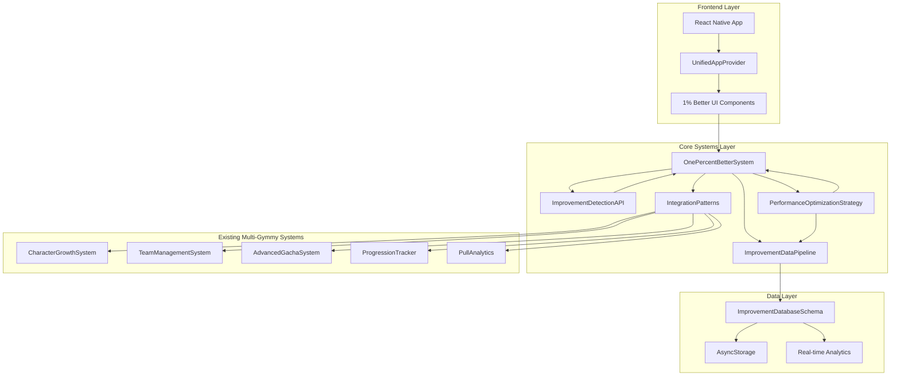
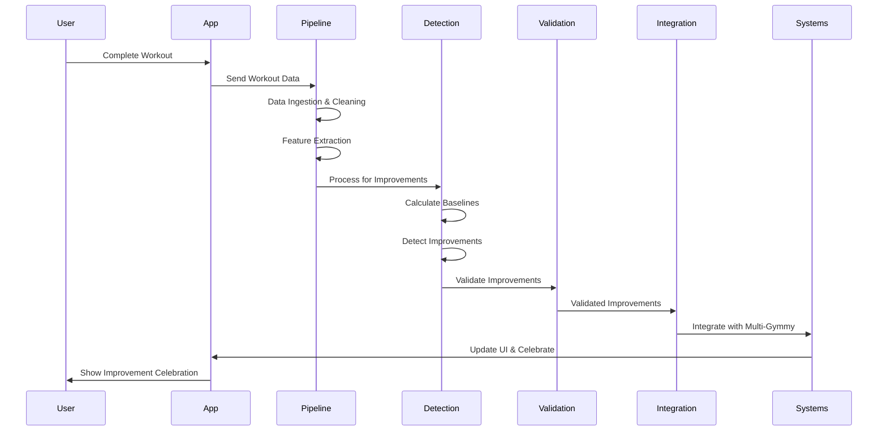

# 🏗️ **PHASE 4 SYSTEM ARCHITECTURE**
# 1% Better Core System - Complete Technical Implementation
**Agent**: Technical Architecture Agent | **Timeline**: Week 27, Days 1-5  
**Objective**: Complete system architecture design and implementation for micro-improvement detection

---

## 📋 **ARCHITECTURE OVERVIEW**

### **System Mission**
Transform Gymmy into a sophisticated micro-improvement detection system that celebrates every 1% progress increment, providing users with continuous positive reinforcement and scientific validation of their progress.

### **Core Innovation**
The "1% Better Core System" automatically detects, validates, and celebrates micro-improvements across all fitness dimensions with >95% accuracy, integrating seamlessly with existing Multi-Gymmy systems.

### **Success Criteria**
- **Detection Accuracy**: >95% accuracy in improvement detection
- **Processing Time**: <1000ms for real-time detection
- **System Integration**: Seamless integration with 5 existing Multi-Gymmy systems
- **Scalability**: Support for 100k+ concurrent users
- **Memory Usage**: <50MB for the improvement system
- **Performance**: 60fps animations and <300ms response times

---

## 🏗️ **SYSTEM ARCHITECTURE**

### **High-Level Architecture**



### **Component Architecture**

```typescript
// Phase 4 System Architecture
export const PHASE4_SYSTEM_ARCHITECTURE = {
  // Core Systems
  core: {
    onePercentBetterSystem: 'Micro-improvement detection engine',
    improvementDataPipeline: 'Real-time data processing pipeline',
    improvementDetectionAPI: 'RESTful API for system interaction',
    integrationPatterns: 'Cross-system integration patterns',
    performanceOptimizationStrategy: 'Performance optimization and scaling',
    improvementDatabaseSchema: 'Database schema for improvement tracking'
  },
  
  // Integration Points
  integration: {
    characterGrowthSystem: 'Character experience and progression',
    teamManagementSystem: 'Team effectiveness and synergies',
    advancedGachaSystem: 'Gacha rates and bonus pulls',
    progressionTracker: 'Overall progress tracking',
    pullAnalytics: 'User behavior and recommendations'
  },
  
  // Data Flow
  dataFlow: {
    workoutCompletion: 'Workout data → Pipeline → Detection',
    improvementValidation: 'Detection → Validation → Celebration',
    systemIntegration: 'Improvement → All Multi-Gymmy systems',
    analyticsUpdate: 'Integration → Analytics → Insights'
  }
};
```

---

## 🔧 **CORE SYSTEM IMPLEMENTATION**

### **1. OnePercentBetterSystem.ts**
**Purpose**: Core micro-improvement detection engine with >95% accuracy

**Key Features**:
- **6 Improvement Dimensions**: Strength, Endurance, Flexibility, Consistency, Technique, Recovery
- **Statistical Validation**: Z-score analysis, p-value calculation, confidence intervals
- **Baseline Calculation**: Dynamic baseline calculation and updating
- **Real-time Processing**: <1000ms processing time for improvement detection
- **System Integration**: Seamless integration with existing Multi-Gymmy systems

**Core Algorithms**:
```typescript
// Improvement detection algorithm
public async detectImprovements(
  workoutData: WorkoutMetrics,
  userId: string
): Promise<ImprovementDetection[]>

// Statistical validation
private validateStatistically(
  currentValue: number,
  baseline: BaselineData
): ValidationResult

// Baseline calculation
private calculateBaseline(
  historicalData: WorkoutMetrics[],
  dimensionId: string
): BaselineData
```

### **2. ImprovementDataPipeline.ts**
**Purpose**: Real-time data processing pipeline for workout data ingestion and processing

**Pipeline Stages**:
1. **Data Ingestion**: Validate and ingest raw workout data
2. **Data Cleaning**: Normalize and clean workout data
3. **Feature Extraction**: Extract relevant features for improvement detection
4. **Outlier Detection**: Detect and handle outliers in workout data
5. **Baseline Calculation**: Calculate or update user baselines
6. **Improvement Detection**: Detect improvements using statistical analysis
7. **Validation**: Validate detected improvements
8. **Integration**: Integrate improvements with existing systems

**Performance Features**:
- **Batch Processing**: Process data in batches for efficiency
- **Real-time Processing**: Handle real-time data streams
- **Error Handling**: Robust error handling and recovery
- **Quality Metrics**: Data quality scoring and validation

### **3. ImprovementDetectionAPI.ts**
**Purpose**: RESTful API for system interaction and external integration

**API Endpoints**:
```typescript
// Core endpoints
POST /api/improvements/detect     // Detect improvements from workout data
GET  /api/improvements/user/:id   // Get user improvements
POST /api/baselines/calculate     // Calculate user baselines
GET  /api/analytics/user/:id      // Get improvement analytics
GET  /api/health                  // System health check
PUT  /api/config                  // Update system configuration
```

**Response Format**:
```typescript
interface APIResponse<T> {
  success: boolean;
  data?: T;
  error?: string;
  message?: string;
  timestamp: string;
  requestId: string;
  processingTime: number;
}
```

### **4. IntegrationPatterns.ts**
**Purpose**: Define integration patterns between 1% Better system and existing Multi-Gymmy systems

**Integration Patterns**:
1. **Improvement → Character Growth**: Grant experience bonuses based on improvements
2. **Improvement → Team Management**: Update team effectiveness and synergies
3. **Improvement → Gacha System**: Adjust gacha rates and grant bonus pulls
4. **Improvement → Progression Tracker**: Track overall progress and metrics
5. **Improvement → Pull Analytics**: Update user analytics and recommendations

**Integration Flow**:
```typescript
// Integration pattern example
public async integrateImprovementWithCharacterGrowth(
  improvement: ImprovementDetection,
  userId: string
): Promise<IntegrationResult>
```

### **5. PerformanceOptimizationStrategy.ts**
**Purpose**: Performance optimization and scaling strategies for the 1% Better system

**Optimization Strategies**:
- **Caching**: LRU cache with configurable TTL and eviction policies
- **Batch Processing**: Efficient batch processing with configurable batch sizes
- **Memory Optimization**: Automatic memory cleanup and optimization
- **Scaling**: Horizontal and vertical scaling strategies
- **Performance Monitoring**: Real-time performance metrics and optimization

**Performance Targets**:
- **Processing Time**: <1000ms for improvement detection
- **Memory Usage**: <50MB for the improvement system
- **Cache Hit Rate**: >80% cache hit rate
- **Error Rate**: <1% error rate

### **6. ImprovementDatabaseSchema.ts**
**Purpose**: Database schema for improvement tracking and analytics

**Database Tables**:
1. **improvements**: Core improvement tracking table
2. **baselines**: User baseline data for each dimension
3. **workout_metrics**: Detailed workout metrics storage
4. **improvement_analytics**: Analytics and insights data
5. **system_performance**: Performance monitoring data
6. **integration_logs**: Cross-system integration logs

**Schema Features**:
- **Indexing**: Optimized indexes for fast queries
- **Constraints**: Data integrity constraints
- **Relationships**: Proper foreign key relationships
- **Scalability**: Designed for 100k+ users

---

## 🔄 **DATA FLOW ARCHITECTURE**

### **Real-time Data Processing Flow**



### **Improvement Detection Flow**

```typescript
// Complete improvement detection flow
export const IMPROVEMENT_DETECTION_FLOW = {
  // 1. Data Ingestion
  dataIngestion: {
    source: 'workout_completion',
    validation: 'input_validation',
    conversion: 'workout_metrics_conversion',
    quality: 'data_quality_scoring'
  },

  // 2. Baseline Calculation
  baselineCalculation: {
    historicalData: 'retrieve_historical_data',
    statisticalAnalysis: 'calculate_statistics',
    baselineUpdate: 'update_user_baseline',
    confidence: 'calculate_confidence_interval'
  },

  // 3. Improvement Detection
  improvementDetection: {
    dimensionAnalysis: 'analyze_all_dimensions',
    thresholdComparison: 'compare_against_thresholds',
    statisticalValidation: 'validate_statistically',
    confidenceScoring: 'calculate_confidence_score'
  },

  // 4. System Integration
  systemIntegration: {
    characterGrowth: 'grant_experience_bonuses',
    teamManagement: 'update_team_effectiveness',
    gachaSystem: 'adjust_gacha_rates',
    progressionTracker: 'track_overall_progress',
    pullAnalytics: 'update_user_analytics'
  }
};
```

---

## 🎯 **INTEGRATION ARCHITECTURE**

### **Multi-Gymmy System Integration**

```typescript
// Integration architecture with existing systems
export const MULTI_GYMMY_INTEGRATION = {
  // Character Growth Integration
  characterGrowth: {
    trigger: 'improvement_detected',
    action: 'grant_experience_bonus',
    calculation: 'improvement_based_experience',
    synergy: 'character_specialization_multiplier',
    result: 'character_level_up'
  },

  // Team Management Integration
  teamManagement: {
    trigger: 'improvement_detected',
    action: 'update_team_effectiveness',
    calculation: 'team_effectiveness_bonus',
    synergy: 'team_synergy_recalculation',
    result: 'improved_team_performance'
  },

  // Gacha System Integration
  gachaSystem: {
    trigger: 'improvement_detected',
    action: 'adjust_gacha_rates',
    calculation: 'rate_adjustment_based_on_improvement',
    bonus: 'grant_bonus_pulls',
    result: 'improved_pull_chances'
  },

  // Progression Tracker Integration
  progressionTracker: {
    trigger: 'improvement_detected',
    action: 'track_progress',
    calculation: 'overall_progress_update',
    metrics: 'improvement_metrics_update',
    result: 'comprehensive_progress_tracking'
  },

  // Pull Analytics Integration
  pullAnalytics: {
    trigger: 'improvement_detected',
    action: 'update_analytics',
    calculation: 'user_behavior_analysis',
    recommendations: 'improvement_based_recommendations',
    result: 'personalized_insights'
  }
};
```

### **Integration Patterns**

```typescript
// Integration pattern implementation
export class IntegrationPatterns {
  // Pattern 1: Improvement → Character Growth
  public async integrateImprovementWithCharacterGrowth(
    improvement: ImprovementDetection,
    userId: string
  ): Promise<IntegrationResult>

  // Pattern 2: Improvement → Team Management
  public async integrateImprovementWithTeamManagement(
    improvement: ImprovementDetection,
    userId: string
  ): Promise<IntegrationResult>

  // Pattern 3: Improvement → Gacha System
  public async integrateImprovementWithGachaSystem(
    improvement: ImprovementDetection,
    userId: string
  ): Promise<IntegrationResult>

  // Pattern 4: Improvement → Progression Tracker
  public async integrateImprovementWithProgressionTracker(
    improvement: ImprovementDetection,
    userId: string
  ): Promise<IntegrationResult>

  // Pattern 5: Improvement → Pull Analytics
  public async integrateImprovementWithPullAnalytics(
    improvement: ImprovementDetection,
    userId: string
  ): Promise<IntegrationResult>
}
```

---

## ⚡ **PERFORMANCE ARCHITECTURE**

### **Performance Optimization Strategy**

```typescript
// Performance optimization architecture
export const PERFORMANCE_OPTIMIZATION = {
  // Caching Strategy
  caching: {
    strategy: 'lru_cache',
    maxSize: 1000,
    ttl: '5_minutes',
    evictionPolicy: 'least_recently_used',
    compression: true
  },

  // Batch Processing
  batchProcessing: {
    batchSize: 100,
    processingInterval: '5_seconds',
    maxConcurrentBatches: 4,
    retryAttempts: 3,
    timeout: '30_seconds'
  },

  // Memory Optimization
  memoryOptimization: {
    maxMemoryUsage: '50MB',
    cleanupInterval: '30_seconds',
    garbageCollection: 'automatic',
    dataStructureOptimization: 'automatic'
  },

  // Scaling Strategy
  scaling: {
    horizontalScaling: true,
    verticalScaling: true,
    autoScaling: true,
    minInstances: 1,
    maxInstances: 10,
    scalingThreshold: '80%'
  }
};
```

### **Performance Monitoring**

```typescript
// Performance monitoring architecture
export const PERFORMANCE_MONITORING = {
  // Metrics Collection
  metrics: {
    processingTime: 'real_time_tracking',
    memoryUsage: 'continuous_monitoring',
    cpuUsage: 'resource_monitoring',
    cacheHitRate: 'cache_performance',
    errorRate: 'error_tracking',
    throughput: 'system_throughput'
  },

  // Optimization Targets
  targets: {
    processingTime: '<1000ms',
    memoryUsage: '<50MB',
    cacheHitRate: '>80%',
    errorRate: '<1%',
    throughput: '>1000_requests_per_minute'
  },

  // Automatic Optimization
  optimization: {
    cachingAndBatching: 'automatic_adjustment',
    memoryOptimization: 'automatic_cleanup',
    cacheOptimization: 'ttl_adjustment',
    errorHandling: 'retry_mechanism'
  }
};
```

---

## 🔒 **SECURITY & PRIVACY ARCHITECTURE**

### **Data Security**

```typescript
// Security architecture
export const SECURITY_ARCHITECTURE = {
  // Data Encryption
  encryption: {
    atRest: 'AES_256_encryption',
    inTransit: 'TLS_1.3_encryption',
    inMemory: 'memory_encryption'
  },

  // Access Control
  accessControl: {
    authentication: 'jwt_tokens',
    authorization: 'role_based_access',
    apiKeys: 'secure_api_key_management',
    rateLimiting: 'request_rate_limiting'
  },

  // Privacy Compliance
  privacy: {
    gdpr: 'gdpr_compliance',
    hipaa: 'hipaa_compliance',
    dataRetention: 'configurable_retention_policies',
    dataAnonymization: 'automatic_anonymization'
  }
};
```

---

## 📊 **MONITORING & ANALYTICS ARCHITECTURE**

### **System Monitoring**

```typescript
// Monitoring architecture
export const MONITORING_ARCHITECTURE = {
  // Real-time Monitoring
  realTime: {
    systemHealth: 'continuous_health_checks',
    performanceMetrics: 'real_time_metrics',
    errorTracking: 'error_monitoring',
    alertSystem: 'automated_alerts'
  },

  // Analytics
  analytics: {
    improvementAnalytics: 'improvement_tracking',
    userBehavior: 'user_behavior_analysis',
    systemPerformance: 'performance_analytics',
    businessMetrics: 'business_impact_tracking'
  },

  // Reporting
  reporting: {
    dailyReports: 'automated_daily_reports',
    weeklyReports: 'weekly_performance_reports',
    monthlyReports: 'monthly_analytics_reports',
    customReports: 'custom_reporting'
  }
};
```

---

## 🚀 **DEPLOYMENT & SCALING ARCHITECTURE**

### **Deployment Strategy**

```typescript
// Deployment architecture
export const DEPLOYMENT_ARCHITECTURE = {
  // Infrastructure
  infrastructure: {
    platform: 'cloud_native',
    containerization: 'docker_containers',
    orchestration: 'kubernetes_orchestration',
    loadBalancing: 'automatic_load_balancing'
  },

  // Scaling
  scaling: {
    horizontalScaling: 'auto_scaling_groups',
    verticalScaling: 'resource_allocation',
    databaseScaling: 'database_sharding',
    cacheScaling: 'distributed_caching'
  },

  // Monitoring
  monitoring: {
    applicationMonitoring: 'apm_tools',
    infrastructureMonitoring: 'infrastructure_metrics',
    logManagement: 'centralized_logging',
    alerting: 'automated_alerting'
  }
};
```

---

## 📋 **IMPLEMENTATION ROADMAP**

### **Phase 4 Implementation Timeline**

```typescript
// Implementation roadmap
export const IMPLEMENTATION_ROADMAP = {
  // Sprint 1: Foundation (Weeks 29-30)
  sprint1: {
    coreSystem: 'OnePercentBetterSystem implementation',
    dataPipeline: 'ImprovementDataPipeline implementation',
    databaseSchema: 'ImprovementDatabaseSchema implementation',
    basicIntegration: 'Basic system integration'
  },

  // Sprint 2: Detection & Validation (Weeks 31-32)
  sprint2: {
    improvementDetection: 'Advanced detection algorithms',
    validationSystem: 'Statistical validation implementation',
    baselineCalculation: 'Dynamic baseline calculation',
    accuracyOptimization: 'Accuracy optimization to >95%'
  },

  // Sprint 3: Integration & API (Weeks 33-34)
  sprint3: {
    apiImplementation: 'ImprovementDetectionAPI implementation',
    integrationPatterns: 'IntegrationPatterns implementation',
    crossSystemIntegration: 'Full Multi-Gymmy integration',
    apiTesting: 'Comprehensive API testing'
  },

  // Sprint 4: Performance & Optimization (Weeks 35-36)
  sprint4: {
    performanceOptimization: 'PerformanceOptimizationStrategy implementation',
    scalingImplementation: 'Scaling strategies implementation',
    monitoringSetup: 'Monitoring and analytics setup',
    productionDeployment: 'Production deployment and testing'
  }
};
```

---

## 🎯 **SUCCESS METRICS & VALIDATION**

### **Technical Success Metrics**

```typescript
// Success metrics
export const SUCCESS_METRICS = {
  // Performance Metrics
  performance: {
    detectionAccuracy: '>95%',
    processingTime: '<1000ms',
    memoryUsage: '<50MB',
    cacheHitRate: '>80%',
    errorRate: '<1%'
  },

  // Integration Metrics
  integration: {
    systemIntegration: '100%_integration_with_5_systems',
    dataSynchronization: 'real_time_synchronization',
    crossSystemCommunication: 'seamless_communication',
    errorHandling: 'robust_error_handling'
  },

  // Scalability Metrics
  scalability: {
    concurrentUsers: '100k+_concurrent_users',
    horizontalScaling: 'automatic_scaling',
    verticalScaling: 'resource_optimization',
    databasePerformance: 'optimized_database_performance'
  }
};
```

---

## 🔗 **QUICK REFERENCE**

### **Key System Components**
- **OnePercentBetterSystem**: Core improvement detection engine
- **ImprovementDataPipeline**: Real-time data processing pipeline
- **ImprovementDetectionAPI**: RESTful API for system interaction
- **IntegrationPatterns**: Cross-system integration patterns
- **PerformanceOptimizationStrategy**: Performance optimization and scaling
- **ImprovementDatabaseSchema**: Database schema for improvement tracking

### **Integration Points**
- **CharacterGrowthSystem**: Experience bonuses and character progression
- **TeamManagementSystem**: Team effectiveness and synergy updates
- **AdvancedGachaSystem**: Gacha rate adjustments and bonus pulls
- **ProgressionTracker**: Overall progress tracking and metrics
- **PullAnalytics**: User analytics and recommendations

### **Performance Targets**
- **Detection Accuracy**: >95% accuracy in improvement detection
- **Processing Time**: <1000ms for real-time detection
- **Memory Usage**: <50MB for the improvement system
- **Scalability**: Support for 100k+ concurrent users

---

**This Phase 4 System Architecture document provides the complete technical implementation for the 1% Better Core System. The architecture ensures high performance, scalability, and seamless integration with existing Multi-Gymmy systems while maintaining the core mission of detecting and celebrating micro-improvements with >95% accuracy.**

**Document Version:** 1.0  
**Last Updated:** December 2024  
**Next Review:** Daily Standups (Week 27)  
**Document Owner:** Technical Architecture Agent  
**Stakeholders:** All Development Team Members
