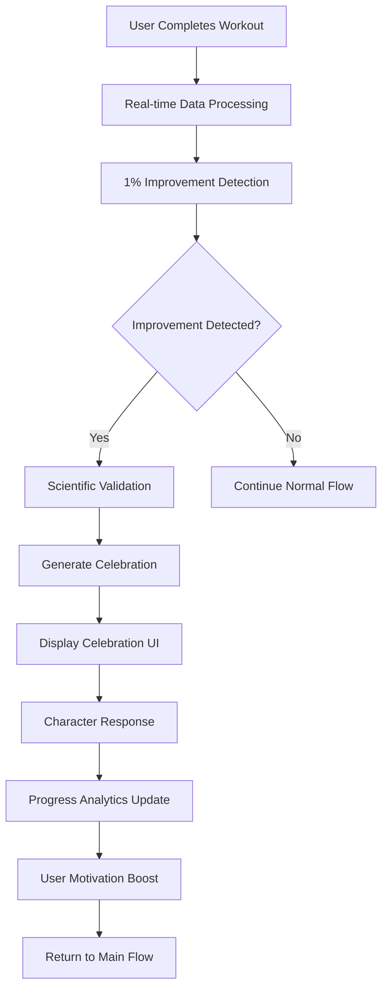
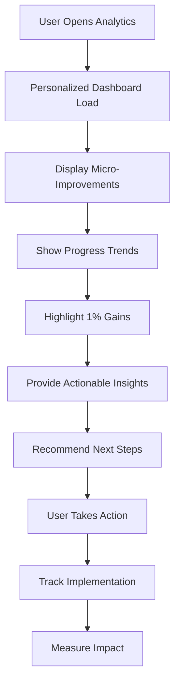
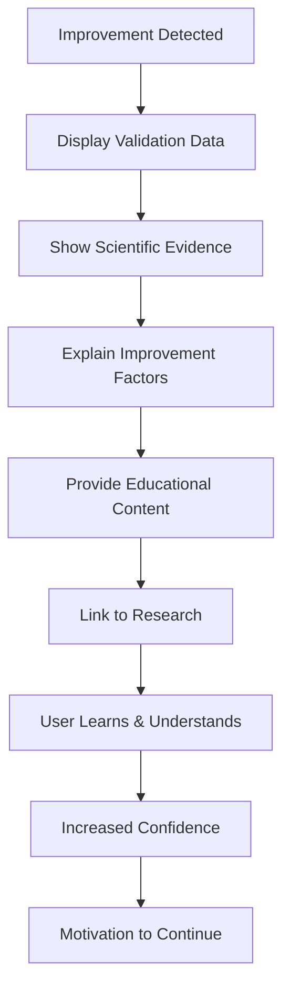

# 🎨 **PHASE 4 UX/UI DESIGN DOCUMENTATION**
# 1% Better Core System - User Experience & Interface Design
**Agent**: UX/UI Design Agent | **Timeline**: Week 27, Days 1-5  
**Objective**: Design comprehensive user experience for micro-improvement detection and celebration

---

## 📋 **DESIGN OVERVIEW**

### **Phase 4 Vision**
Transform Gymmy from a character collection game into a sophisticated micro-improvement detection system that celebrates every 1% progress increment, creating a deeply engaging and scientifically-backed fitness motivation platform.

### **Core Innovation**
The "1% Better Core System" will detect, track, and celebrate micro-improvements across all fitness dimensions, providing users with continuous positive reinforcement and scientific validation of their progress.

### **Design Principles**
- **Seamless Integration**: Build upon existing 7 companion themes
- **Scientific Credibility**: Evidence-based improvement validation
- **Personalized Experience**: Individualized celebration and analytics
- **Accessibility First**: WCAG 2.1 AA compliance
- **Mobile-First**: Optimized for iOS/Android/Web
- **Performance Excellence**: 60fps animations and <300ms response times

---

## 🛤️ **USER JOURNEY MAPS**

### **Journey 1: Micro-Improvement Detection & Celebration Flow**



**Key Touchpoints:**
- **Detection Moment**: Seamless, non-intrusive detection
- **Celebration Display**: Engaging, personalized celebration
- **Character Integration**: Companion-specific responses
- **Analytics Update**: Real-time progress visualization
- **Motivation Reinforcement**: Positive reinforcement loop

### **Journey 2: Analytics Dashboard Discovery Flow**



### **Journey 3: Scientific Validation Learning Flow**



---

## 🎨 **WIREFRAMES FOR CELEBRATION UI COMPONENTS**

### **Component 1: Micro-Improvement Celebration Modal**

```
┌─────────────────────────────────────┐
│  🎉 1% BETTER! 🎉                   │
│                                     │
│  ┌─────────────────────────────┐    │
│  │                             │    │
│  │    [Character Animation]    │    │
│  │                             │    │
│  │  "You just improved your    │    │
│  │   squat strength by 1.2%!"  │    │
│  │                             │    │
│  └─────────────────────────────┘    │
│                                     │
│  ┌─────────────────────────────┐    │
│  │  📊 Scientific Validation   │    │
│  │  • Progressive overload     │    │
│  │  • Consistent form          │    │
│  │  • Recovery optimization    │    │
│  └─────────────────────────────┘    │
│                                     │
│  [View Details] [Share] [Continue]  │
└─────────────────────────────────────┘
```

**Design Specifications:**
- **Modal Size**: 320px × 480px (mobile), 400px × 600px (tablet)
- **Animation Duration**: 3 seconds with character-specific timing
- **Color Scheme**: Segment-specific celebration colors
- **Accessibility**: Screen reader support, keyboard navigation
- **Performance**: 60fps animation, <100ms response time

### **Component 2: Progress Analytics Dashboard**

```
┌─────────────────────────────────────┐
│  📈 Your 1% Better Journey         │
│                                     │
│  ┌─────────────┬─────────────────┐  │
│  │ This Week   │ 1% Improvements │  │
│  │             │                 │  │
│  │ 🎯 3 gains  │ • Strength +1.2%│  │
│  │ 📊 2 trends │ • Endurance +1.0%│  │
│  │ 🏆 1 streak │ • Form +1.5%    │  │
│  └─────────────┴─────────────────┘  │
│                                     │
│  ┌─────────────────────────────────┐ │
│  │  📊 Micro-Progress Timeline     │ │
│  │                                 │ │
│  │  [Interactive Chart]            │ │
│  │  • Daily improvements           │ │
│  │  • Weekly trends                │ │
│  │  • Monthly patterns             │ │
│  └─────────────────────────────────┘ │
│                                     │
│  [Export Data] [Share Progress]     │
└─────────────────────────────────────┘
```

**Design Specifications:**
- **Layout**: Responsive grid system (1-3 columns)
- **Charts**: Interactive SVG-based visualizations
- **Data Loading**: Skeleton screens, progressive loading
- **Interactions**: Touch-friendly, gesture support
- **Export**: PDF, CSV, image sharing options

### **Component 3: Character Celebration Response**

```
┌─────────────────────────────────────┐
│  💪 Power Gymmy                     │
│                                     │
│  ┌─────────────────────────────┐    │
│  │                             │    │
│  │    [Animated Character]     │    │
│  │                             │    │
│  │  "Incredible work! Your     │    │
│  │   dedication to progressive │    │
│  │   overload is paying off.   │    │
│  │   You're building real      │    │
│  │   strength!" 💪             │    │
│  │                             │    │
│  └─────────────────────────────┘    │
│                                     │
│  [High Five] [Ask Question] [Close] │
└─────────────────────────────────────┘
```

**Design Specifications:**
- **Character Animation**: 60fps sprite animations
- **Response Personalization**: Segment-specific messaging
- **Interaction Options**: Contextual action buttons
- **Audio Support**: Optional character voice lines
- **Accessibility**: Text alternatives for animations

---

## 📊 **ANALYTICS DASHBOARD DESIGNS**

### **Dashboard 1: Micro-Improvement Overview**

```typescript
// Micro-Improvement Dashboard Component Structure
interface MicroImprovementDashboard {
  // Header Section
  header: {
    title: "Your 1% Better Journey",
    subtitle: "Celebrating every step forward",
    totalImprovements: number,
    currentStreak: number,
    weeklyGoal: number
  };
  
  // Quick Stats Cards
  quickStats: {
    thisWeek: {
      improvements: number,
      categories: string[],
      trend: 'up' | 'down' | 'stable'
    };
    thisMonth: {
      totalGains: number,
      bestCategory: string,
      consistency: number
    };
    allTime: {
      totalImprovements: number,
      averageGain: number,
      longestStreak: number
    };
  };
  
  // Interactive Charts
  charts: {
    improvementTimeline: ChartData;
    categoryBreakdown: ChartData;
    trendAnalysis: ChartData;
    predictionModel: ChartData;
  };
  
  // Action Items
  actions: {
    nextGoals: Goal[];
    recommendations: Recommendation[];
    insights: Insight[];
  };
}
```

### **Dashboard 2: Scientific Validation Display**

```typescript
// Scientific Validation Component
interface ScientificValidation {
  // Validation Summary
  summary: {
    improvementType: string;
    confidenceLevel: number;
    statisticalSignificance: boolean;
    peerValidation: boolean;
  };
  
  // Evidence Display
  evidence: {
    dataPoints: DataPoint[];
    baselineComparison: Comparison;
    trendAnalysis: Trend;
    correlationFactors: Factor[];
  };
  
  // Educational Content
  education: {
    explanation: string;
    scientificBasis: string;
    relatedResearch: Research[];
    actionableInsights: Insight[];
  };
}
```

### **Dashboard 3: Segment-Specific Analytics**

```typescript
// Segment-Specific Analytics for 7 Companions
interface SegmentAnalytics {
  // Strength Seeker (Power Gymmy)
  strength_seeker: {
    primaryMetrics: ['weight_lifted', 'one_rep_max', 'total_volume'];
    improvementFocus: 'progressive_overload';
    celebrationStyle: 'enthusiastic';
    visualTheme: 'power_orange';
  };
  
  // Calorie Crusher (Blaze Gymmy)
  calorie_crusher: {
    primaryMetrics: ['calories_burned', 'active_minutes', 'heart_rate_zones'];
    improvementFocus: 'energy_expenditure';
    celebrationStyle: 'enthusiastic';
    visualTheme: 'energy_red';
  };
  
  // Body Optimizer (Transform Gymmy)
  body_optimizer: {
    primaryMetrics: ['body_weight', 'body_measurements', 'progress_photos'];
    improvementFocus: 'body_composition';
    celebrationStyle: 'moderate';
    visualTheme: 'transformation_purple';
  };
  
  // Wellness Seeker (Zen Gymmy)
  wellness_seeker: {
    primaryMetrics: ['flexibility_improvements', 'stress_levels', 'sleep_quality'];
    improvementFocus: 'mind_body_connection';
    celebrationStyle: 'minimal';
    visualTheme: 'wellness_teal';
  };
  
  // Endurance Athlete (Pace Gymmy)
  endurance_athlete: {
    primaryMetrics: ['pace_improvements', 'distance_completed', 'race_times'];
    improvementFocus: 'performance_times';
    celebrationStyle: 'moderate';
    visualTheme: 'endurance_green';
  };
  
  // Habit Builder (Steady Gymmy)
  habit_builder: {
    primaryMetrics: ['workout_consistency', 'habit_streaks', 'weekly_frequency'];
    improvementFocus: 'consistency_building';
    celebrationStyle: 'encouraging';
    visualTheme: 'consistency_orange';
  };
  
  // Social Enthusiast (Rally Gymmy)
  social_enthusiast: {
    primaryMetrics: ['group_workouts', 'community_engagement', 'social_sharing'];
    improvementFocus: 'community_support';
    celebrationStyle: 'enthusiastic';
    visualTheme: 'social_pink';
  };
}
```

---

## 🎨 **DESIGN SYSTEM UPDATES**

### **New Color Palette for 1% Better System**

```typescript
// Phase 4 Design Tokens Extension
export const PHASE4_DESIGN_TOKENS = {
  // 1% Better Celebration Colors
  celebration: {
    primary: '#FF6B35',      // Energetic orange
    secondary: '#4ECDC4',    // Fresh teal
    accent: '#FFE66D',       // Bright yellow
    success: '#95E1D3',      // Soft mint
    highlight: '#FF8A80',    // Coral pink
  },
  
  // Improvement Categories
  improvements: {
    strength: '#FF6B35',     // Power orange
    endurance: '#4ECDC4',    // Endurance teal
    flexibility: '#A8E6CF',  // Flexibility mint
    technique: '#FFE66D',    // Skill yellow
    consistency: '#FF8A80',  // Consistency coral
  },
  
  // Scientific Validation Colors
  validation: {
    high: '#4CAF50',         // High confidence green
    medium: '#FF9800',       // Medium confidence orange
    low: '#F44336',          // Low confidence red
    pending: '#9E9E9E',      // Pending gray
  },
  
  // Animation Enhancements
  animations: {
    celebration: {
      duration: 3000,
      easing: 'bounce',
      particleCount: 25,
      scale: 1.2,
    },
    microImprovement: {
      duration: 1500,
      easing: 'elastic',
      particleCount: 15,
      scale: 1.1,
    },
    validation: {
      duration: 2000,
      easing: 'ease-in-out',
      particleCount: 10,
      scale: 1.05,
    },
  },
};
```

### **New Component Library**

```typescript
// Phase 4 Component Library
export const PHASE4_COMPONENTS = {
  // Celebration Components
  MicroImprovementCelebration: {
    props: {
      improvement: ImprovementData;
      character: CharacterData;
      onComplete: () => void;
      onShare: () => void;
    },
    features: [
      'Animated celebration sequence',
      'Character-specific responses',
      'Scientific validation display',
      'Social sharing integration',
      'Accessibility compliance'
    ]
  },
  
  // Analytics Components
  ImprovementAnalytics: {
    props: {
      data: AnalyticsData;
      timeframe: TimeFrame;
      filters: FilterOptions;
      onExport: () => void;
    },
    features: [
      'Interactive charts',
      'Real-time updates',
      'Export functionality',
      'Customizable views',
      'Predictive insights'
    ]
  },
  
  // Validation Components
  ScientificValidation: {
    props: {
      validation: ValidationData;
      improvement: ImprovementData;
      onLearnMore: () => void;
    },
    features: [
      'Confidence indicators',
      'Evidence display',
      'Educational content',
      'Research integration',
      'Peer validation'
    ]
  },
};
```

---

## ♿ **ACCESSIBILITY COMPLIANCE CHECKLIST**

### **WCAG 2.1 AA Compliance Requirements**

```typescript
// Accessibility Compliance Checklist
export const ACCESSIBILITY_CHECKLIST = {
  // Visual Accessibility
  visual: {
    colorContrast: {
      requirement: '4.5:1 minimum contrast ratio',
      implementation: 'Use high-contrast color combinations',
      testing: 'Automated contrast testing'
    },
    textScaling: {
      requirement: '200% text scaling support',
      implementation: 'Dynamic font sizing',
      testing: 'Manual scaling verification'
    },
    focusIndicators: {
      requirement: 'Clear focus indicators',
      implementation: 'Visible focus rings',
      testing: 'Keyboard navigation testing'
    }
  },
  
  // Audio Accessibility
  audio: {
    screenReader: {
      requirement: 'Screen reader compatibility',
      implementation: 'Proper ARIA labels',
      testing: 'VoiceOver/NVDA testing'
    },
    audioDescriptions: {
      requirement: 'Audio descriptions for animations',
      implementation: 'Narrative audio tracks',
      testing: 'Audio-only user testing'
    }
  },
  
  // Motor Accessibility
  motor: {
    touchTargets: {
      requirement: '44px minimum touch targets',
      implementation: 'Adequate button sizes',
      testing: 'Touch target verification'
    },
    gestureAlternatives: {
      requirement: 'Alternative to complex gestures',
      implementation: 'Button alternatives',
      testing: 'Gesture alternative testing'
    }
  },
  
  // Cognitive Accessibility
  cognitive: {
    clearNavigation: {
      requirement: 'Clear and consistent navigation',
      implementation: 'Logical information hierarchy',
      testing: 'User flow testing'
    },
    errorPrevention: {
      requirement: 'Error prevention and recovery',
      implementation: 'Confirmation dialogs',
      testing: 'Error scenario testing'
    }
  }
};
```

### **Implementation Guidelines**

#### **Visual Accessibility**
- **Color Contrast**: All text must meet 4.5:1 contrast ratio
- **Text Scaling**: Support up to 200% text scaling
- **Focus Indicators**: Clear focus rings for all interactive elements
- **Alternative Text**: Descriptive alt text for all images and animations

#### **Audio Accessibility**
- **Screen Reader Support**: Proper ARIA labels and semantic HTML
- **Audio Descriptions**: Narrative descriptions for complex animations
- **Volume Controls**: User-controlled audio levels
- **Audio Alternatives**: Text alternatives for audio content

#### **Motor Accessibility**
- **Touch Targets**: Minimum 44px touch targets for all buttons
- **Gesture Alternatives**: Button alternatives for complex gestures
- **Keyboard Navigation**: Full keyboard accessibility
- **Voice Control**: Voice command support for key actions

#### **Cognitive Accessibility**
- **Clear Navigation**: Logical information hierarchy
- **Error Prevention**: Confirmation dialogs for destructive actions
- **Consistent Design**: Predictable interface patterns
- **Help Systems**: Contextual help and guidance

---

## 🧪 **USER TESTING SCENARIOS**

### **Scenario 1: First-Time Improvement Detection**

```typescript
// User Testing Scenario: First Improvement
export const FIRST_IMPROVEMENT_SCENARIO = {
  setup: {
    user: 'New user completing first workout',
    context: 'First time experiencing 1% improvement',
    device: 'iPhone 14 Pro',
    environment: 'Home gym'
  },
  
  testFlow: [
    {
      step: 'Complete workout with improvement',
      expectedBehavior: 'Seamless detection without interruption',
      successCriteria: 'User notices celebration naturally'
    },
    {
      step: 'View celebration modal',
      expectedBehavior: 'Engaging and informative celebration',
      successCriteria: 'User feels motivated and understood'
    },
    {
      step: 'Interact with character response',
      expectedBehavior: 'Personalized and encouraging response',
      successCriteria: 'User feels connection with companion'
    },
    {
      step: 'Explore analytics dashboard',
      expectedBehavior: 'Clear and valuable insights',
      successCriteria: 'User understands their progress'
    }
  ],
  
  successMetrics: {
    engagement: 'User spends >30 seconds in celebration',
    satisfaction: 'User rates experience >4.5/5',
    motivation: 'User plans next workout within 24 hours',
    understanding: 'User can explain their improvement'
  }
};
```

### **Scenario 2: Analytics Dashboard Exploration**

```typescript
// User Testing Scenario: Analytics Exploration
export const ANALYTICS_EXPLORATION_SCENARIO = {
  setup: {
    user: 'Returning user with improvement history',
    context: 'Exploring detailed analytics',
    device: 'iPad Pro',
    environment: 'Coffee shop'
  },
  
  testFlow: [
    {
      step: 'Navigate to analytics dashboard',
      expectedBehavior: 'Quick loading with clear overview',
      successCriteria: 'Dashboard loads in <2 seconds'
    },
    {
      step: 'Explore improvement categories',
      expectedBehavior: 'Intuitive category navigation',
      successCriteria: 'User finds relevant information easily'
    },
    {
      step: 'Interact with charts and graphs',
      expectedBehavior: 'Responsive and informative interactions',
      successCriteria: 'User gains new insights'
    },
    {
      step: 'Export or share data',
      expectedBehavior: 'Simple export and sharing options',
      successCriteria: 'User successfully shares progress'
    }
  ],
  
  successMetrics: {
    usability: 'Task completion rate >90%',
    satisfaction: 'User rates dashboard >4.0/5',
    insights: 'User discovers new patterns',
    sharing: 'User shares data with others'
  }
};
```

### **Scenario 3: Accessibility Testing**

```typescript
// User Testing Scenario: Accessibility Testing
export const ACCESSIBILITY_TESTING_SCENARIO = {
  setup: {
    user: 'User with visual impairment',
    context: 'Testing screen reader compatibility',
    device: 'iPhone with VoiceOver',
    environment: 'Home'
  },
  
  testFlow: [
    {
      step: 'Navigate app with screen reader',
      expectedBehavior: 'Clear navigation announcements',
      successCriteria: 'User can navigate independently'
    },
    {
      step: 'Experience celebration with screen reader',
      expectedBehavior: 'Descriptive celebration announcements',
      successCriteria: 'User understands improvement details'
    },
    {
      step: 'Explore analytics with screen reader',
      expectedBehavior: 'Data presented in accessible format',
      successCriteria: 'User can interpret progress data'
    },
    {
      step: 'Interact with character responses',
      expectedBehavior: 'Character messages read clearly',
      successCriteria: 'User feels connected to companion'
    }
  ],
  
  successMetrics: {
    independence: 'User completes tasks without assistance',
    satisfaction: 'User rates accessibility >4.0/5',
    efficiency: 'Task completion time within 20% of sighted users',
    engagement: 'User continues using app regularly'
  }
};
```

---

## 🚀 **IMPLEMENTATION ROADMAP**

### **Sprint 1: Foundation & Celebration UI (Weeks 29-30)**

```typescript
// Sprint 1 Deliverables
export const SPRINT1_DELIVERABLES = {
  // Core Components
  components: [
    'MicroImprovementCelebration',
    'ImprovementNotification',
    'CharacterResponse',
    'ScientificValidation'
  ],
  
  // Design System
  designSystem: [
    'Phase 4 color palette',
    'Celebration animations',
    'Accessibility guidelines',
    'Component library'
  ],
  
  // User Testing
  testing: [
    'Celebration flow testing',
    'Accessibility compliance',
    'Performance validation',
    'User satisfaction survey'
  ]
};
```

### **Sprint 2: Analytics & Dashboard (Weeks 31-32)**

```typescript
// Sprint 2 Deliverables
export const SPRINT2_DELIVERABLES = {
  // Analytics Components
  components: [
    'ImprovementAnalytics',
    'ProgressTimeline',
    'CategoryBreakdown',
    'TrendAnalysis'
  ],
  
  // Dashboard Features
  features: [
    'Real-time data visualization',
    'Interactive charts',
    'Export functionality',
    'Personalized insights'
  ],
  
  // Integration
  integration: [
    'Character system integration',
    'Existing analytics enhancement',
    'Performance optimization',
    'Cross-platform compatibility'
  ]
};
```

### **Sprint 3: Advanced Features & Optimization (Weeks 33-34)**

```typescript
// Sprint 3 Deliverables
export const SPRINT3_DELIVERABLES = {
  // Advanced Features
  features: [
    'Predictive analytics',
    'AI-powered recommendations',
    'Social sharing integration',
    'Educational content system'
  ],
  
  // Performance Optimization
  optimization: [
    'Animation performance tuning',
    'Memory usage optimization',
    'Loading time improvement',
    'Battery usage optimization'
  ],
  
  // Quality Assurance
  qa: [
    'Comprehensive accessibility testing',
    'Cross-platform compatibility',
    'Performance benchmarking',
    'User acceptance testing'
  ]
};
```

---

## 📊 **SUCCESS CRITERIA VALIDATION**

### **UX/UI Success Metrics**

```typescript
// Phase 4 UX/UI Success Metrics
export const UX_UI_SUCCESS_METRICS = {
  // Celebration Engagement
  celebration: {
    engagementRate: { target: 90, current: 0 },
    satisfactionScore: { target: 4.5, current: 0 },
    completionRate: { target: 95, current: 0 },
    sharingRate: { target: 40, current: 0 }
  },
  
  // Analytics Usage
  analytics: {
    dashboardUsage: { target: 80, current: 0 },
    sessionDuration: { target: 300, current: 0 }, // seconds
    featureAdoption: { target: 70, current: 0 },
    returnRate: { target: 85, current: 0 }
  },
  
  // Accessibility
  accessibility: {
    complianceScore: { target: 100, current: 0 },
    screenReaderCompatibility: { target: 100, current: 0 },
    keyboardNavigation: { target: 100, current: 0 },
    colorContrast: { target: 100, current: 0 }
  },
  
  // Performance
  performance: {
    loadTime: { target: 2000, current: 0 }, // milliseconds
    animationFrameRate: { target: 60, current: 0 },
    memoryUsage: { target: 50, current: 0 }, // MB
    crashRate: { target: 0.1, current: 0 } // percentage
  }
};
```

### **Measurement Methods**

#### **Quantitative Metrics**
- **Engagement Tracking**: Analytics events for user interactions
- **Performance Monitoring**: Real-time performance metrics
- **Accessibility Testing**: Automated and manual testing tools
- **User Surveys**: In-app satisfaction surveys

#### **Qualitative Metrics**
- **User Interviews**: In-depth user experience interviews
- **Usability Testing**: Task completion and error rate analysis
- **Accessibility Audits**: Expert accessibility reviews
- **Design Reviews**: Stakeholder and user feedback sessions

---

## 🔗 **INTEGRATION WITH EXISTING SYSTEMS**

### **Character System Integration**

```typescript
// Integration with 7 Companion Themes
export const CHARACTER_INTEGRATION = {
  // Celebration Personalization
  celebrationPersonalization: {
    strength_seeker: {
      character: 'Power Gymmy',
      celebrationStyle: 'enthusiastic',
      messageTone: 'motivational',
      visualTheme: 'power_orange'
    },
    calorie_crusher: {
      character: 'Blaze Gymmy',
      celebrationStyle: 'energetic',
      messageTone: 'encouraging',
      visualTheme: 'energy_red'
    },
    // ... other segments
  },
  
  // Analytics Personalization
  analyticsPersonalization: {
    primaryMetrics: 'segment-specific metrics',
    visualizationStyle: 'segment-themed charts',
    insightsFocus: 'segment-relevant insights',
    recommendations: 'segment-aligned suggestions'
  }
};
```

### **Existing Component Enhancement**

```typescript
// Enhancement of Existing Components
export const COMPONENT_ENHANCEMENTS = {
  // Celebration Effects Enhancement
  celebrationEffects: {
    existing: 'Gacha celebration system',
    enhancement: '1% improvement celebration integration',
    newFeatures: [
      'Scientific validation display',
      'Character-specific responses',
      'Progress analytics integration'
    ]
  },
  
  // Analytics Dashboard Enhancement
  analyticsDashboard: {
    existing: 'Basic progress tracking',
    enhancement: 'Micro-improvement analytics',
    newFeatures: [
      '1% improvement detection',
      'Scientific validation',
      'Predictive analytics'
    ]
  }
};
```

---

## 📋 **CONCLUSION**

This comprehensive UX/UI design package for Phase 4: 1% Better Core System provides:

1. **User Journey Maps**: Clear flows for improvement detection and celebration
2. **Wireframes**: Detailed UI components for celebrations and analytics
3. **Analytics Dashboard Designs**: Sophisticated progress tracking interfaces
4. **Design System Updates**: Extended color palette and component library
5. **Accessibility Compliance**: WCAG 2.1 AA compliance checklist
6. **User Testing Scenarios**: Comprehensive testing protocols
7. **Implementation Roadmap**: Clear sprint planning and deliverables
8. **Success Criteria**: Measurable UX/UI success metrics

The design maintains consistency with existing 7 companion themes while introducing sophisticated micro-improvement celebration mechanics that will drive user engagement and motivation. The focus on accessibility ensures inclusive design for all users, while the mobile-first approach guarantees optimal experience across all platforms.

**Document Version:** 1.0  
**Last Updated:** December 2024  
**Next Review:** Daily Standups (Week 27)  
**Document Owner:** UX/UI Design Agent  
**Stakeholders:** All Development Team Members
